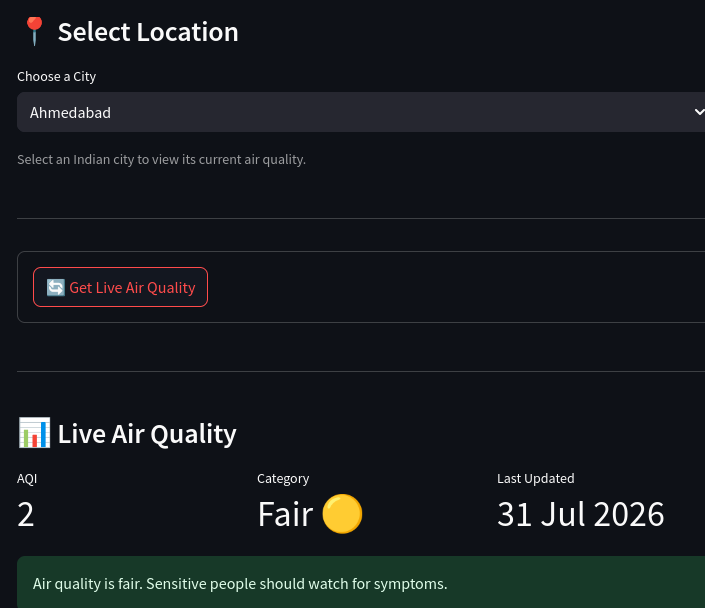
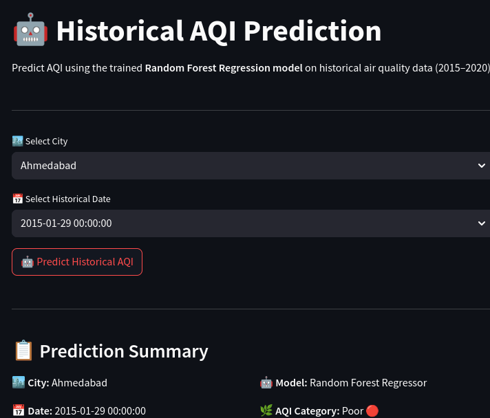
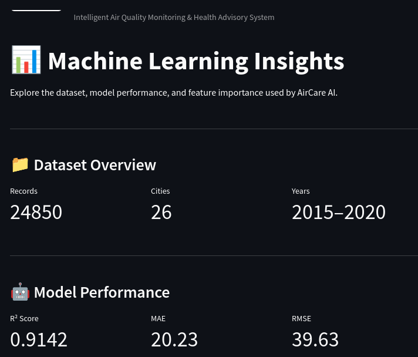
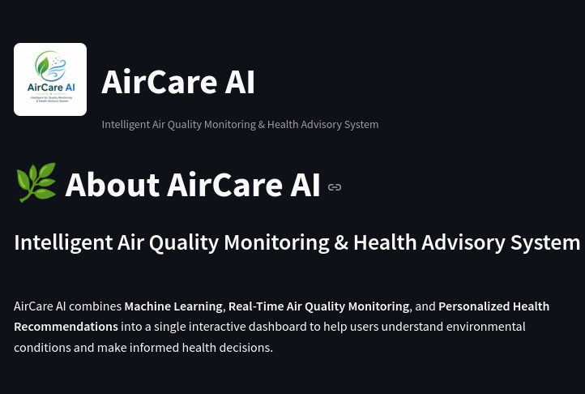

# 🌿 AirCare AI

> **An Intelligent Air Quality Monitoring & Health Advisory System powered by Machine Learning and Real-Time Environmental Data.**
## 🚀 Live Demo

👉 **Try the application here:**

**https://aircare-ai-alr7.onrender.com**

AirCare AI combines a **Random Forest Machine Learning model** trained on historical Indian air quality data with **real-time OpenWeather APIs** to provide live AQI monitoring, pollutant analysis, historical AQI prediction, and personalized health recommendations through an interactive Streamlit dashboard.

---
# 🌿 AirCare AI


## 🚀 Features

- 🌍 Live Air Quality Monitoring using OpenWeather API
- 🤖 Historical AQI Prediction using a trained Random Forest model
- 📊 Machine Learning Insights and Feature Importance
- 🧪 Real-Time Pollutant Monitoring
- 🩺 Personalized Health Advisory based on AQI
- 📈 Interactive Visualizations
- ⚡ Fast performance using Streamlit caching
- 🎨 Clean multi-page dashboard interface

---

## 📸 Application Preview

### 🏠 Live Air Quality Dashboard

> 

---

### 🤖 Historical AQI Prediction

> 

---

### 📊 Machine Learning Insights

> 

---

### ℹ️ About AirCare AI

> 

---

# 🏗️ Project Architecture

```text
                    OpenWeather API
                 (Geocoding + AQI API)
                         │
                         ▼
                 Real-Time Pollutants
                         │
                         ▼
                  AirCare AI Dashboard
                         │
        ┌────────────────┴───────────────┐
        ▼                                ▼
 Historical ML Model             Health Advisory
(Random Forest Regressor)      (AQI-based Guidance)
        │
        ▼
 AQI Prediction & Insights
```

---

# 🧠 Machine Learning Model

### Model

- Random Forest Regressor
- Hyperparameter Tuned using RandomizedSearchCV

### Dataset

- Indian Air Quality Dataset
- Duration: **2015 – 2020**
- Multiple Indian Cities
- Target Variable: AQI

### Model Performance

| Metric | Score |
|---------|------:|
| R² Score | **0.9142** |
| MAE | **20.23** |
| RMSE | **39.63** |

---

# 📊 Important Features

The model identified the following as the most influential predictors of AQI:

- PM2.5
- CO
- PM10
- NO
- City
- NO₂
- O₃
- SO₂

---

# 🛠️ Tech Stack

### Programming Language

- Python

### Machine Learning

- Scikit-learn
- Joblib

### Data Processing

- Pandas
- NumPy

### Visualization

- Plotly
- Streamlit

### APIs

- OpenWeather Geocoding API
- OpenWeather Air Pollution API

---

# 📂 Project Structure

```text
AirCare-AI
│
├── app/
│   ├── pages/
│   ├── components/
│   ├── api.py
│   ├── advisory.py
│   ├── utils.py
│   └── app.py
│
├── models/
│
├── data/
│
├── assets/
│
├── notebooks/
│
├── README.md
│
└── requirements.txt
```

---

# ⚙️ Installation

Clone the repository:

```bash
git clone https://github.com/shailajadurgam60-ai/AirCare-AI.git
```

Move into the project directory:

```bash
cd AirCare-AI
```

Install dependencies:

```bash
pip install -r requirements.txt
```

Create a Streamlit secrets file:

```text
app/.streamlit/secrets.toml
```

Add your OpenWeather API key:

```toml
OPENWEATHER_API_KEY = "YOUR_API_KEY"
```

Run the application:

```bash
streamlit run app/app.py
```

---

# 🌟 Future Improvements

- AQI Forecasting using Time Series Models
- Weather-aware AQI Prediction
- Location Detection using GPS
- Mobile Application
- Air Pollution Trend Analytics
- Smart Notifications & Alerts

---

# 🎯 Project Highlights

- End-to-End Machine Learning Project
- Real-Time API Integration
- Interactive Dashboard
- Historical Data Analysis
- Personalized Health Recommendations
- Modular Streamlit Application
- Production-ready UI

---

# 👩‍💻 Author

**Shailaja Durgam**

Electronics & Communication Engineering  
Rajiv Gandhi University of Knowledge Technologies (RGUKT), Basar

---

## ⭐ If you found this project helpful, consider giving it a star!
